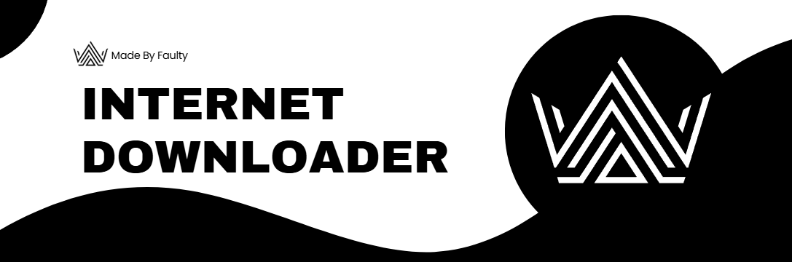

# 📁INTERNET DOWNLOADER📁



# 💿CURRENT SERVICES💿

Currently working services include:

- Spotify
- SoundCloud
- YouTube

More services might be implimented in the future.

# ❓Have any questions or issues?❓

Make sure to create an issue, I will try and respond and help you.


# 🚀INSTALLATION🚀
Before Running:
- 📂 Download and unzip the downloader and stash the folder where you won't lose it
- ⚙️ Open a Command Prompt / Terminal
- 📃 Input `cd` then drag and drop the folder containing `main.py` onto the terminal window
- ↪️ Hit Enter
- 📦 Run this command to install required libraries:
```
pip install -r requirements.txt
```

# 👟USING THE DOWNLOADER👟
## 📃Downloading from list file📃
- 💬 Open the `list.txt` file in your favourite text editor
- ⌨️ Put your links into the file how the examples are
- 📜 Run the `mainlist.py` script
- ⭐ Follow the instructions to download all of the files
- ⏳ Wait for it to download each link, Invalid / Unsupported links will be skipped

## ✍️Downloading manually✍️
- 💬 Prepare your links to download
- ⭐ Run the `main.py` script
- ✍️ Follow the instructions to download individual links

# 🆘KNOWN ISSUES🆘
> [!IMPORTANT]
> - 📃 Custom downloads folders are broken, only downloads to the same directory as `main.py`
